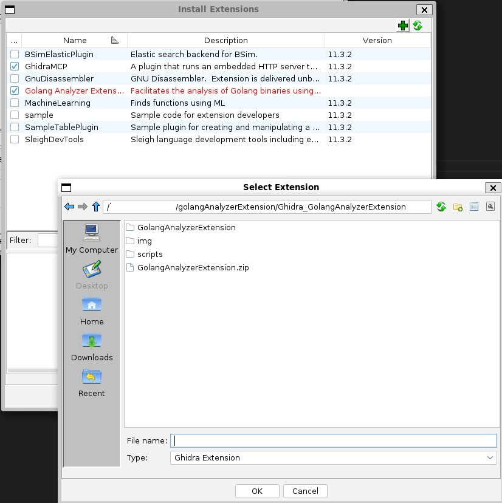
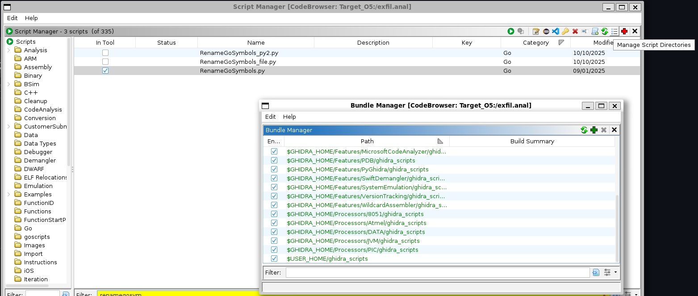
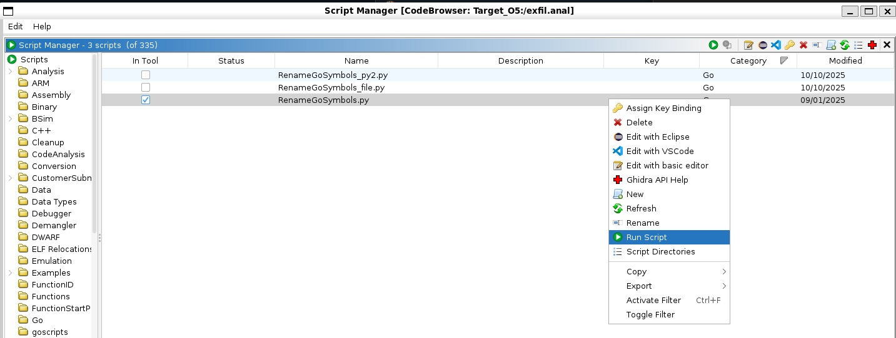
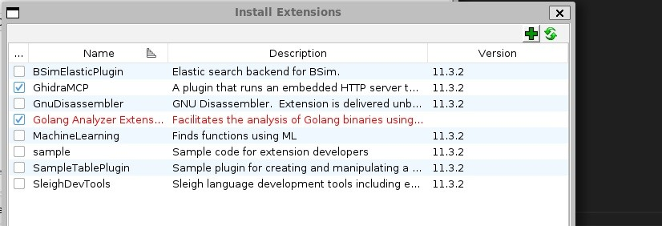
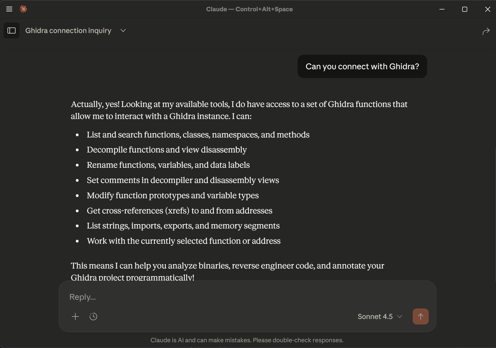
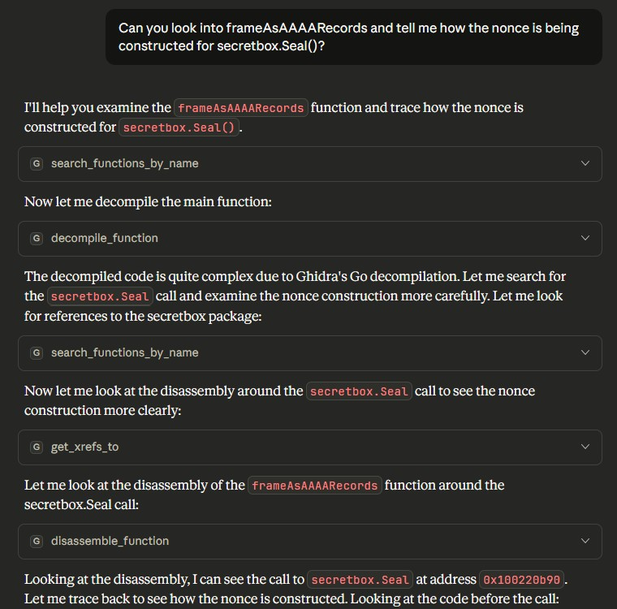
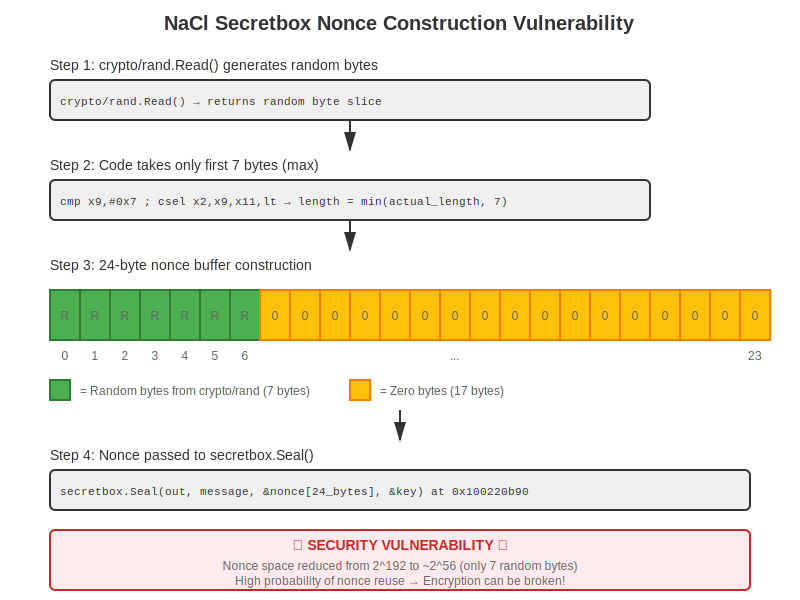

<h1>O5 Tunnel Vision</h1>
The write-up is not a complete walkthrough. However, it captured all the tool installation for the binary analysis, including Claude Desktop setup with GhidraMCP.

The binary exfil is included for analysis. The client implementation can be found in dnsexfil_client.py and doh.py. However, since the server is not hosted, the client cannot be tested.

For complete walkthrough, you can refer to https://aeronique.medium.com/2025-target-cyber-defense-challenge-o5-tunnel-vision-6ac2d75d6ed5 by Michelle Duell.

The presentation slide for WiCyS 2026 conference titled "Reverse Engineering CTF with Ghidra for DNS Exfiltration" will be posted after the conference.

<h2> 1. Installation</h2>
<h3>1.1 Install Kali Linux</h3>
Windows: https://www.kali.org/docs/wsl/wsl-preparations/

Notes: this is a popular linux box for many pre-installed hacker tools. However, with the WSL
version, many tools are not there including Ghidra. So, Ghidra is installed manually below.

<h3> 1.2 Install, start and kill Ghidra</h2>
The Ghidra version I used for the challenge was 11.3.2. However, the latest version should work as well or even better.
<pre>
sudo apt update
sudo apt install -y ghidra
</pre>

To start Ghidra:
<pre>ghidra &</pre>

To exit Ghidra if it is frozen or unresponsive in GUI:
<pre>
List the process id used by ghidra:
ps -aux | grep ghidra

Response:
venusli+    5421  2.2  9.3 10428180 746248 pts/2 Sl   09:49 ....

Then, kill the process by running below command:
kill -9 [precess_id]
e.g. kill -9 5421
</pre>

<h2>2. Install GolangAnalyzerExtension </h2>
Reference: https://github.com/mooncat-greenpy/Ghidra_GolangAnalyzerExtension
Credit to Michelle Duell for finding this extension. I did not use this extension during the challenge,
but using GoReSym instead. However, after installing this extension, I believe this is a simpler way
to rename variables and identify many of the Go internal data structures. If you use this method,
you can skip step 3 and 4 below.

<h3>2.1 Clone and install GolangAnalyzerExtension</h3>
1. Clone the workspace below and zip the GolangAnalyzerExtension subfolder.

<pre>git clone https://github.com/mooncat-greenpy/Ghidra_GolangAnalyzerExtension.git</pre>

2. Update name and version in GolangAnalyzerExtension/extension.properties. Otherwise, the placeholder @xxx@ will be shown after installing the extension.
<pre>
name=Golang Analyzer Extension
version=@extversion@ (It's ok to left as is, but you can also update to match your Ghidra's version)
</pre>

3. Zip the GolangAnalyzerExtension folder into GolangAnalyzerExtension.zip
<pre>zip -r GolangAnalyzerExtension.zip GolangAnalyzerExtension</pre>

4. Install extension in Ghidra 
Click File -> Install Extension

If the Extension is already there, you can enable it. If it is now shown, click "+" to install the zip file created in step 3.

5. Check if go1.25.gdt exists in your installed Ghidra. If not, you will see below messages during analysis and the functions are not renamed.
<b>"Missing goland .gdt archive for 1.25, no fallback DWARF info, unable to extract Golang RTTI info."</b>

<pre><Ghidra_installation_path>/Ghidra/Features/Base/data/typeinfo/golang/go1.25.gdt</pre>

During my test, the file does not exist, I just created a symbolic link to point go1.25.gdt to go1.23.gdt.
<pre>
/usr/share/ghidra/Ghidra/Features/Base/data/typeinfo/golang:
└─$ sudo ln -s golang_1.23_anybit_any.gdt golang_1.25_anybit_any.gdt
</pre>

6. Import exfil file and begin analysis!
You can keep most analysis options as default. You should see the function names right away!

<h2>3. Install GoReSym for symbol analysis</h2>
Reference: https://github.com/mandiant/GoReSym
git clone https://github.com/mandiant/GoReSym.git

<b>Note: this is not needed if you install GolangAnalyzerExtension in Step 2!</b>

Run analysis:
<pre>GoReSym -t -d -p exfil > symbols.json</pre>

Then, copy the symbols.json into the script directory. 

<h2>4. Perform “import → rename → re-analyze” approach in Ghidra</h2>

<b>Note: this is not needed if you install GolangAnalyzerExtension in Step 2!</b>

<h3>4.1 Import exfil from Ghidra </h3>
File -> Import File

Then, give them the "exfil" file to import.

<h3>4.2 Analysis setting:</h3>

Unchecked initially:
- Function Start Search
- Call Convention ID
- Decompiler Parameter ID
- Decompiler Switch Analysis

Checked initially:
- Non-Returning Functions
- Data Reference
- Disassemble Entry Points
- Demangler GNU (harmless)

<h3>4.3. Run RenameGoSymbols.py in Ghidra </h3>
a. Start Script Manager in Ghidra by clicking Window -> Script Manager

b. Add script directories
Click "Manage Script Directories" and add the script directory "ghidra_scripts".

c. Run RenameGoSymbols.py by clicking "play". You will need to point to the symbols.json generated in Step 3 to complete the step.

<pre>
Sample outputs:
RenameGoSymbols.py> Running...
Auto-slide: image_base=0x100000000, chosen delta=0x0
Failed to set body for internal_sync.(*HashTrieMap[go.shape.interface_{},go.shape.interface_{}]).CompareAndSwap.deferwrap1: 'NoneType' object has no attribute 'setBody'
Failed to set body for github.com_miekg_dns.(*SVCBMandatory).pack.func1: 'NoneType' object has no attribute 'setBody'
Failed to set body for go:buildid: 'NoneType' object has no attribute 'setBody'
Failed to set body for runtime.allocmcache.func1: 'NoneType' object has no attribute 'setBody'
Failed to set body for runtime.entersyscallblock.func2: 'NoneType' object has no attribute 'setBody'
Failed to set body for runtime.exitsyscall.func2: 'NoneType' object has no attribute 'setBody'
Failed to set body for runtime.malg.func1: 'NoneType' object has no attribute 'setBody'
Failed to set body for runtime.gfget.func2: 'NoneType' object has no attribute 'setBody'
Failed to set body for runtime.gfget.func1: 'NoneType' object has no attribute 'setBody'
Failed to set body for runtime.traceThreadDestroy.func1: 'NoneType' object has no attribute 'setBody'
Failed to set body for runtime.getGCMaskOnDemand.func1: 'NoneType' object has no attribute 'setBody'
Skipping body for runtime.duffzero due to overlap
Skipping body for runtime.duffcopy due to overlap
Failed to set body for net.(*sysDialer).dialParallel.deferwrap1: 'NoneType' object has no attribute 'setBody'
Failed to set body for net.dnsReadConfig.deferwrap1: 'NoneType' object has no attribute 'setBody'
Failed to set body for mime.FormatMediaType.Keys[go.shape.map[string]string,go.shape.string,go.shape.string].func1: 'NoneType' object has no attribute 'setBody'
Failed to set body for net_http.(*Server).Close.deferwrap1: 'NoneType' object has no attribute 'setBody'
Done. Sections processed: UserFunctions, StdFunctions
Created: 2092 | Renamed: 1638 | Resized: 6773 | Commented: 6790
Skipped (addr not in memory): 0 | Conflicts: 0
RenameGoSymbols.py> Finished!
</pre>

<h3>4.4 Re-run Auto Analysis</h3>

Now that you have renamed Go Symbols, re-run Auto Analysis with Call Convention ID and Decompiler Parameter ID enabled so the decompiler benefits from the improved symbols and prototypes.

<h2>5. Claude integration with GhidraMCP</h2>
<h3>5.1 Install GhidraMCP</h3>
Reference: https://github.com/LaurieWired/GhidraMCP
First download the released zip files and then install it using steps similar to step 2. Re-start Ghidra after installation.
Copilot actually gave me much more complicated instructions including compiling golang-ghidra and other modules. However, I found at the end that I could simply install the zip file directly.

a. Install virtual environment for Python 3.x. 
I used Python 3.13 for the virutal environment.

<pre>python3.13 -m venv ghidra-env</pre>
<pre>source ghidra-env/bin/activate</pre>

b. Run below command manually to check that it was exposed correctly. It would start a server instance.
The steps a and b will be run by Claude AI in its configuration in Step 5.2 below.

python3 ~/ghidraMCP/GhidraMCP-release-1-4/bridge_mcp_ghidra.py --ghidra-server http://127.0.0.1:8080/

<h3>5.2 Install Claude desktop</h3>
Reference: https://claude.ai/
The free version would allow you to setup for testing. You can also run Claude with GhidraMCP but the daily usage will be limited.

To use GhidraMCP with Claude, you need to do create/edit the file in <User>\AppData\Roaming\Claude\claude_desktop_config.json
Or, access the file using Settings -> Developer -> Edit Config.
For WSL Ghidra setup, you can use below setting:

<pre>
{
  "mcpServers": {
    "ghidra": {
      "command": "wsl",
      "args": [
        "-d",
        "kali-linux",
        "-e",
        "bash",
        "-c",
        "source ~/ghidra-env/bin/activate && python3 ~/ghidraMCP/GhidraMCP-release-1-4/bridge_mcp_ghidra.py --ghidra-server http://127.0.0.1:8080/"
      ]
    }
  }
}
</pre>

<h3>5.3 Run Claude with Ghidra</h3>
Below steps need to run every time you run the setup

1. Open Ghidra and the project you want to analyze

2. Open Claude Desktop

3. Ask "Can you connect with Ghidra"?

Now you are ready to rock and roll!

<h4>5.3.1 Analyze Box 2 nonce </h4>
In order to test Claude's analysis skill, I tried to ask it to analyze the nonce construction for box 2. Note that it was not correct!
However, if you continue to work with the AI and re-anlayze, I am sure it will get it quickly.

